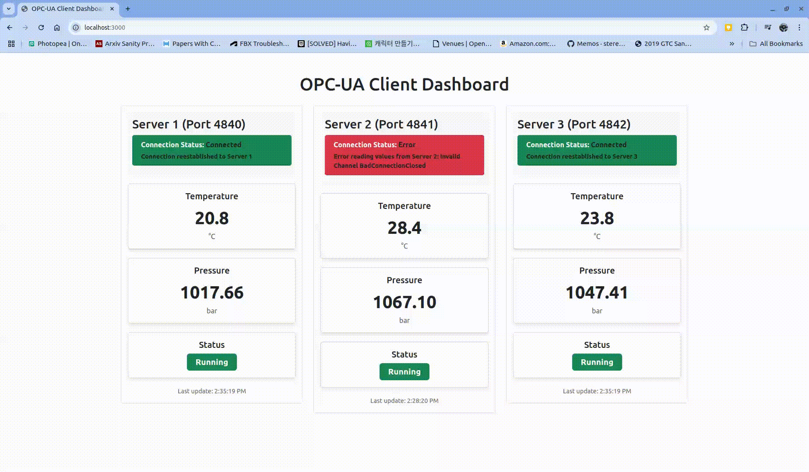

# opc-ua_samples



## Javascript
### node-opcua
* https://node-opcua.github.io/
* https://www.npmjs.com/package/node-opcua
## Python
### FreeOpcUa
* https://python-opcua.readthedocs.io/en/latest/
* https://github.com/FreeOpcUa/python-opcua
## C/C++
### FreeOpcUa
* https://github.com/FreeOpcUa/freeopcua
### open62541
* https://www.open62541.org/
* https://github.com/open62541/open62541
## C#
### OPC Foundation
* https://opcfoundation.org/
* https://github.com/OPCFoundation/UA-.NETStandard-Samples

## Python Server
```
python3 -m pip install --upgrade pip setuptools==70.0.0 importlib_metadata
python3 -m pip install -r requirements.txt
```

## Node.js Client
```
npm install
npm run dev
```


## Run Full Test
```
cd python3
python3 ./server.py --port 4840
```

```
cd python3
python3 ./server.py --port 4841
```

```
cd python3
python3 ./server.py --port 4842
```

```
npm run dev
```
